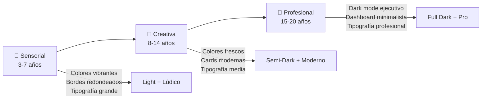
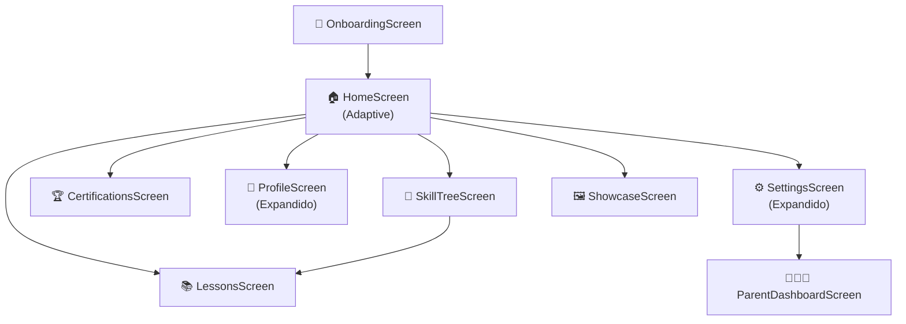
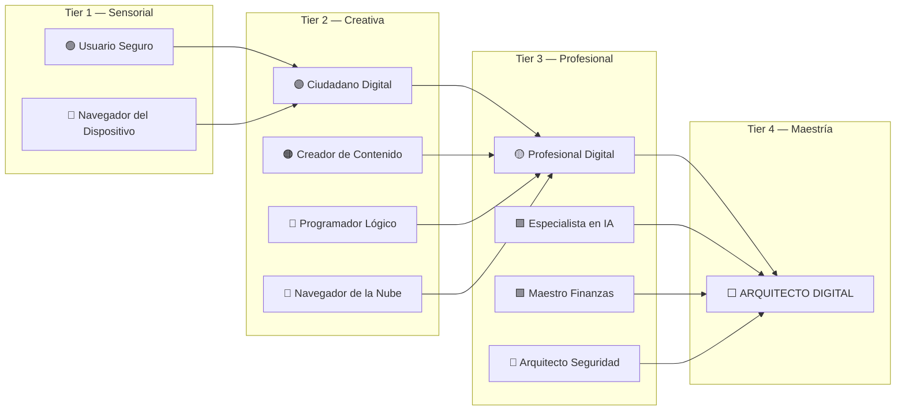

# 🏗️ I.S.D.I — Arquitectura de Producto EdTech Expandida

> **Isla Digital → Digitalización Humana**  
> Plataforma integral de digitalización progresiva para usuarios de 3 a 20 años.

---

## 📋 Diagnóstico del Estado Actual

### ✅ Lo que ya existe (Domain Layer — Sólido)
| Archivo | Estado | Calidad |
|---------|--------|---------|
| [DigitalPhase.kt](file:///c:/AndroidStudioProjects/LBs/app/src/main/java/com/liebeblack/isla_digital/domain/model/DigitalPhase.kt) | ✅ Completo | Enum con [fromAge()](file:///c:/AndroidStudioProjects/LBs/app/src/main/java/com/liebeblack/isla_digital/domain/model/DigitalPhase.kt#36-41), 3 fases bien definidas |
| [SkillNode.kt](file:///c:/AndroidStudioProjects/LBs/app/src/main/java/com/liebeblack/isla_digital/domain/model/SkillNode.kt) | ✅ Completo | 30 nodos, 8 categorías, progreso XP, prerequisitos |
| [Certification.kt](file:///c:/AndroidStudioProjects/LBs/app/src/main/java/com/liebeblack/isla_digital/domain/model/Certification.kt) | ✅ Completo | 11 certificaciones con badge colors |
| [ParentConfig.kt](file:///c:/AndroidStudioProjects/LBs/app/src/main/java/com/liebeblack/isla_digital/domain/model/ParentConfig.kt) | ✅ Completo | PIN, filtros, logs |
| [ChildProfile.kt](file:///c:/AndroidStudioProjects/LBs/app/src/main/java/com/liebeblack/isla_digital/domain/model/ChildProfile.kt) | ⚠️ Requiere expansión | Falta integrar phase, skillTree, certifications |

### ❌ Lo que falta (UI/UX Layer — Stubs vacíos)
| Pantalla | Estado |
|----------|--------|
| HomeScreen | Funcional pero solo para niños (fase Sensorial fija) |
| ProfileScreen | Stub — texto plano |
| LevelsScreen | Stub — solo un botón |
| SettingsScreen | Stub — texto plano |
| ShowcaseScreen | Stub — placeholder |
| OnboardingScreen | ❌ No existe |
| SkillTreeScreen | ❌ No existe |
| CertificationsScreen | ❌ No existe |
| ParentDashboardScreen | ❌ No existe |
| LessonsScreen | ❌ No existe |
| Theme adaptativo | ❌ Solo tema claro |

---

## 🎯 Plan de Expansión Completo

### Fase 1: Modelo de Datos Expandido

**`UserProfile.kt`** — Reemplazo de [ChildProfile.kt](file:///c:/AndroidStudioProjects/LBs/app/src/main/java/com/liebeblack/isla_digital/domain/model/ChildProfile.kt):
```kotlin
data class UserProfile(
    // ... datos base + phase + skillTree + certifications + parentConfig
)
```

> [!IMPORTANT]
> Se mantiene [ChildProfile.kt](file:///c:/AndroidStudioProjects/LBs/app/src/main/java/com/liebeblack/isla_digital/domain/model/ChildProfile.kt) renombrado a `UserProfile.kt` para reflejar el rango 3-20 años.

### Fase 2: Sistema de Tema Adaptativo (Adaptive Growth UI)



#### Paleta Cromática por Fase

| Propiedad | 🧸 Sensorial | 🎨 Creativa | 💼 Profesional |
|-----------|-------------|-------------|----------------|
| **Primary** | `#FF6B6B` Coral Brillante | `#7C4DFF` Púrpura Eléctrico | `#00BFA5` Teal Ejecutivo |
| **Background** | `#FFFBF0` Crema Cálido | `#F0F4FF` Gris-Azul Claro | `#0F172A` Charcoal Profundo |
| **Surface** | `#FFFFFF` Blanco Puro | `#FFFFFF` Blanco | `#1E293B` Slate Oscuro |
| **Accent** | `#FFD700` Sol Dorado | `#00BCD4` Cian Moderno | `#7C4DFF` Púrpura Sofisticado |
| **On Background** | `#2D1B69` Púrpura Oscuro | `#1A1A2E` Azul Noche | `#E2E8F0` Platino |
| **Border Radius** | 28dp (Muy redondeado) | 16dp (Moderado) | 8dp (Elegante) |
| **Elevation** | 8dp (Sombras juguetonas) | 4dp (Sutil) | 2dp (Mínimo) |

#### Tipografía Adaptativa

| Nivel | 🧸 Sensorial | 🎨 Creativa | 💼 Profesional |
|-------|-------------|-------------|----------------|
| **Familia** | Nunito (Redondeada) | Outfit (Geométrica) | Inter (Profesional) |
| **Display** | 48sp / Black | 42sp / Bold | 36sp / SemiBold |
| **Body** | 20sp / SemiBold | 16sp / Regular | 14sp / Regular |
| **Labels** | 18sp / Bold | 14sp / Medium | 12sp / Medium |

### Fase 3: Nuevas Pantallas y Componentes

#### Árbol de Navegación Expandido



#### Componentes Nuevos

| Componente | Descripción | Adaptativo |
|------------|-------------|------------|
| **`AdaptiveCard.kt`** | Card que cambia bordes, sombras, colores por fase | ✅ |
| **`SkillTreeNodeView.kt`** | Nodo visual del árbol con conexiones | ✅ |
| **`ProgressRing.kt`** | Anillo de progreso circular animado | ✅ |
| **`PhaseIndicator.kt`** | Indicador visual de la fase actual | ✅ |
| **`CertBadge.kt`** | Badge hexagonal de certificación | ✅ |
| **`AdaptiveBottomBar.kt`** | Barra de navegación inferior adaptativa | ✅ |
| **`PhaseTransitionOverlay.kt`** | Overlay animado para transición de fase | ✅ |

### Fase 4: Gamificación — Árbol de Habilidades Digitales

```mermaid
graph TB
    subgraph "🛡️ Seguridad Digital"
        S1["Contraseña Mágica"] --> S2["Extraños en Pantalla"]
        S2 --> S3["Pedir Ayuda"]
        S3 --> S4["Ciberseguridad Personal"]
        S4 --> S5["Huella Digital"]
        S5 --> S6["Contraseñas Fuertes"]
        S6 --> S7["Autenticación 2FA"]
        S7 --> S8["Privacidad GDPR"]
    end
    
    subgraph "💻 Programación"
        P1["Pensamiento Lógico"] --> P2["Secuencias y Bucles"]
        P2 --> P3["Variables y Datos"]
        P3 --> P4["Mi Primer Proyecto"]
    end
    
    subgraph "🤖 IA & Tech"
        A1["¿Qué es la IA?"] --> A2["IA Aplicada"]
        A1 --> A3["Ética de Datos"]
    end
```



### Fase 5: Sistema de Certificaciones



### Fase 6: Modo Acompañante (Parent Mode)

#### Protocolos de Privacidad

| Protocolo | Descripción |
|-----------|-------------|
| **PIN de Acceso** | 4-6 dígitos para acceder al panel parental |
| **Datos Locales** | Todo almacenado en SharedPreferences cifrado |
| **Sin Telemetría** | Cero envío de datos a servidores externos |
| **Logs Transparentes** | El padre ve exactamente qué hizo el hijo |
| **No Invasivo** | El hijo NO ve que el padre monitorea |

#### Panel Parental — Secciones

1. **📊 Resumen Semanal** — Tiempo, lecciones, progreso
2. **⏰ Control de Tiempo** — Límites diarios configurables
3. **🔒 Filtro de Contenido** — Estricto / Moderado / Abierto
4. **📋 Log de Actividad** — Timeline cronológico
5. **🏆 Progreso Académico** — Certificaciones y habilidades

---

## 📁 Archivos a Crear/Modificar

### Nuevos Archivos (17 archivos)

```
domain/model/UserProfile.kt              # Perfil expandido (reemplaza ChildProfile)

ui/theme/AdaptiveTheme.kt                # Motor de tema por fase
ui/theme/PhaseColors.kt                  # Paletas específicas por fase
ui/theme/PhaseTypography.kt              # Tipografía adaptativa por fase

ui/components/AdaptiveCard.kt            # Card adaptativa
ui/components/SkillTreeNodeView.kt       # Nodo visual del árbol
ui/components/ProgressRing.kt            # Anillo de progreso
ui/components/PhaseIndicator.kt          # Indicador de fase
ui/components/CertBadge.kt              # Badge de certificación
ui/components/AdaptiveBottomBar.kt       # Bottom navigation adaptativa

ui/screens/onboarding/OnboardingScreen.kt
ui/screens/onboarding/OnboardingViewModel.kt
ui/screens/skilltree/SkillTreeScreen.kt
ui/screens/skilltree/SkillTreeViewModel.kt
ui/screens/certifications/CertificationsScreen.kt
ui/screens/lessons/LessonsScreen.kt
ui/screens/parent/ParentDashboardScreen.kt
```

### Archivos a Modificar (9 archivos)

```diff
- domain/model/ChildProfile.kt          → domain/model/UserProfile.kt
  ui/theme/Color.kt                      → Expandir paleta con PhaseColors
  ui/theme/Type.kt                       → Tipografía por fase
  ui/theme/Theme.kt                      → IslaDigitalTheme adaptativo
  ui/navigation/NavGraph.kt              → Nuevas rutas
  ui/screens/home/HomeScreen.kt          → UI adaptativa por fase
  ui/screens/home/HomeViewModel.kt       → Lógica expandida
  ui/screens/profile/ProfileScreen.kt    → Vista completa con stats
  ui/screens/settings/SettingsScreen.kt  → Modo acompañante integrado
  IslaDigitalApp.kt                      → Registrar nuevos repos/servicios
  MainActivity.kt                        → Pasar fase al tema  
```

---

## 🚀 Orden de Implementación

| Paso | Acción | Prioridad |
|------|--------|-----------|
| 1 | `UserProfile.kt` — Modelo expandido | 🔴 Crítico |
| 2 | `PhaseColors.kt` + `PhaseTypography.kt` — Paletas & Fuentes | 🔴 Crítico |
| 3 | `AdaptiveTheme.kt` — Motor de tema | 🔴 Crítico |
| 4 | [Color.kt](file:///c:/AndroidStudioProjects/LBs/app/src/main/java/com/liebeblack/isla_digital/ui/theme/Color.kt) + [Type.kt](file:///c:/AndroidStudioProjects/LBs/app/src/main/java/com/liebeblack/isla_digital/ui/theme/Type.kt) + [Theme.kt](file:///c:/AndroidStudioProjects/LBs/app/src/main/java/com/liebeblack/isla_digital/ui/theme/Theme.kt) — Actualización | 🔴 Crítico |
| 5 | Componentes adaptativos (5 archivos) | 🟡 Alto |
| 6 | `OnboardingScreen` + ViewModel | 🟡 Alto |
| 7 | [HomeScreen](file:///c:/AndroidStudioProjects/LBs/app/src/main/java/com/liebeblack/isla_digital/ui/screens/home/HomeScreen.kt#30-91) — Rediseño adaptativo | 🟡 Alto |
| 8 | `SkillTreeScreen` + ViewModel | 🟡 Alto |
| 9 | `CertificationsScreen` | 🟢 Medio |
| 10 | `LessonsScreen` | 🟢 Medio |
| 11 | `ParentDashboardScreen` | 🟢 Medio |
| 12 | [ProfileScreen](file:///c:/AndroidStudioProjects/LBs/app/src/main/java/com/liebeblack/isla_digital/ui/screens/profile/ProfileScreen.kt#12-48) + [SettingsScreen](file:///c:/AndroidStudioProjects/LBs/app/src/main/java/com/liebeblack/isla_digital/ui/screens/settings/SettingsScreen.kt#11-40) — Expansión | 🟢 Medio |
| 13 | [NavGraph](file:///c:/AndroidStudioProjects/LBs/app/src/main/java/com/liebeblack/isla_digital/ui/navigation/NavGraph.kt#35-100) + [MainActivity](file:///c:/AndroidStudioProjects/LBs/app/src/main/java/com/liebeblack/isla_digital/MainActivity.kt#15-40) — Integración | 🔴 Crítico |
